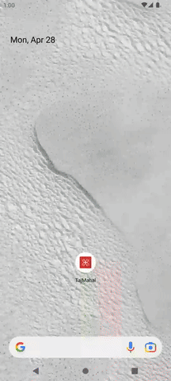
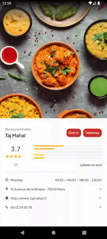
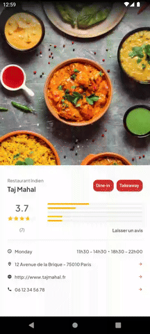
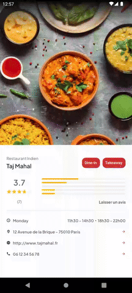
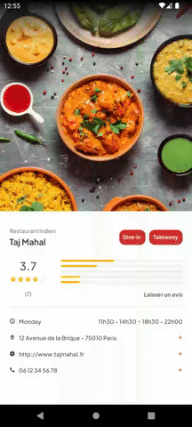

  

# Taj Mahal App

Application Android de gestion d'avis pour le restaurant indien **Taj Mahal**.

Développée en Java avec une architecture **MVVM**, en respectant les bonnes pratiques Android.

---

## 🚀 Présentation du projet

**Contexte** :  
Le restaurant **Taj Mahal**, souhaitant renforcer son image de marque, a commandé une application mobile pour recueillir les **avis clients** et améliorer l'expérience utilisateur.

**Mission** :  
- Créer une interface fluide et dynamique pour laisser et consulter les avis.
- Afficher la moyenne des évaluations.
- Implémenter la gestion des nouveaux avis en garantissant la qualité des données.
- Structurer l'application selon l'architecture **MVVM**.
- Rédiger des **tests unitaires** pour valider la fiabilité de l'application.

---

## ⚙️ Fonctionnalités principales

- Affichage de la **moyenne des notes**.
- Liste dynamique des **avis clients**.
- **Ajout d'un nouvel avis** avec validation des champs.
- **Navigation** entre l'écran principal et l'écran "Nouveau commentaire".
- **Gestion d'erreurs** utilisateur (note ou commentaire vide).
- **Tests unitaires** pour le ViewModel et la logique métier.

---

## 📈 Tâches réalisées

| Étape | Objectifs | Résultats |
| :--- | :--- | :--- |
| **Initialisation du projet** | Mise en place de l'architecture MVVM | Structure projet propre et modulaire |
| **UI Design** | Interface utilisateur intuitive | Ecrans conformes aux maquettes Figma |
| **Gestion des avis** | Création, affichage, validation des avis | Fonctionnalités fiables et testées |
| **Tests unitaires** | Validation de la logique métier | Couverture correcte du ViewModel |
| **Documentation** | README détaillé et clair | Projet prêt pour la livraison finale |

---

## 🛠️ Stack technique

- **Langage** : Java
- **UI** : XML + Material Components
- **Architecture** : MVVM (Model - View - ViewModel)
- **Backend simulé** : FakeAPI
- **Tests** : JUnit
- **IDE** : Android Studio

---

## 📸 Screenshots

| SplashScreen | Navigation | Ajout d'avis |
|:---:|:---:|:---:|
|  |  |  |

| Map link | Website link | Phone link |
|:---:|:---:|:---:|
|  |  |  |

---

## 🎯 Résultat final

✅ Application stable et respectueuse de l'architecture MVVM.  
✅ Interface utilisateur conviviale et moderne.  
✅ Données fiables grâce aux validations intégrées.  
✅ Tests unitaires présents pour sécuriser l'ajout d'avis.

---

